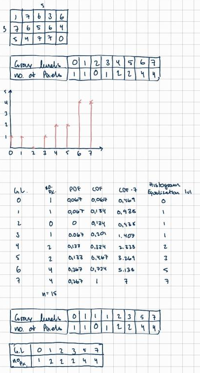
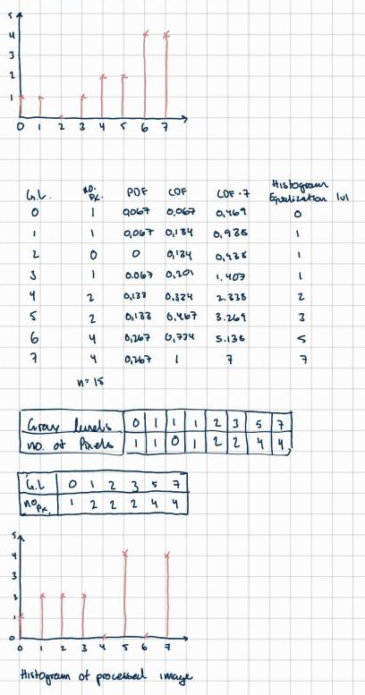
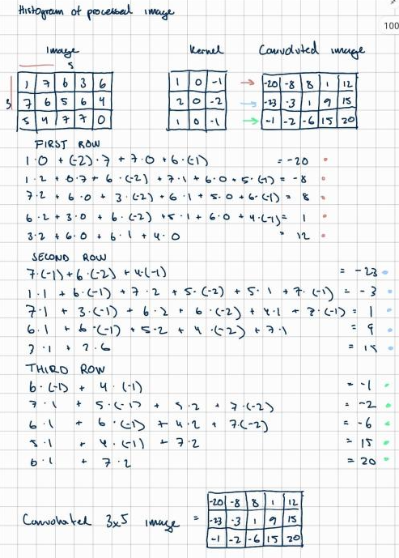
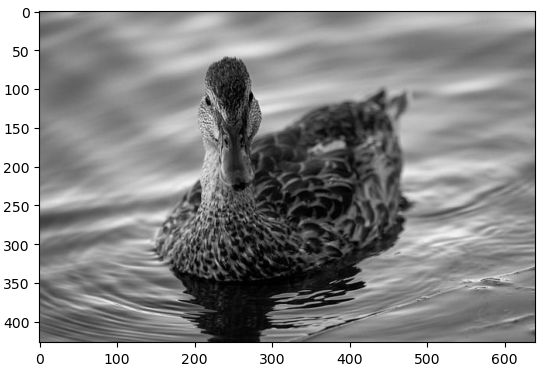
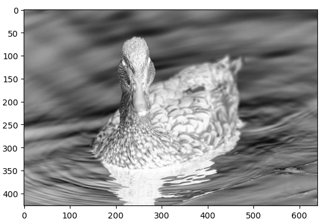
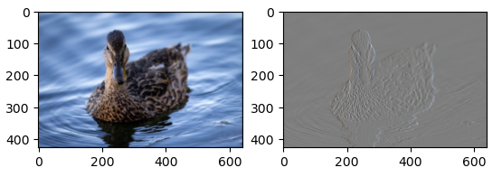
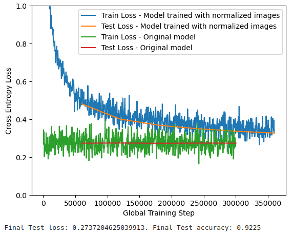
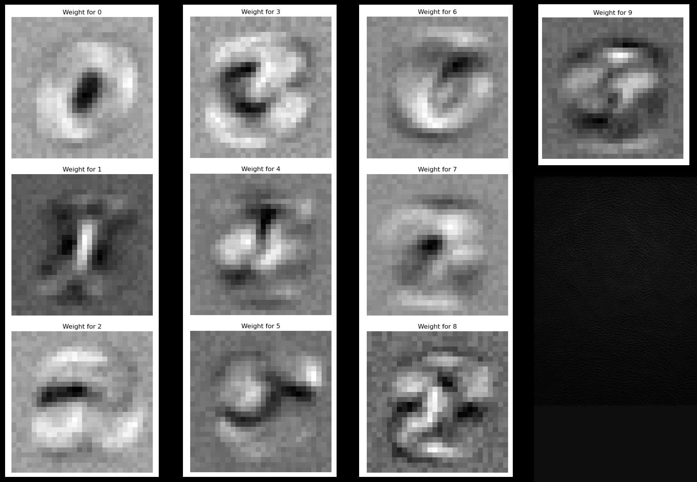

# Report
## Task 1 - Theory
### A) Explain in one sentence what sampling is
Sampling is the process of collecting data from sources such as images, photographs or videos.
### B) Explain in one sentence what quantization is
Quantization refers to a techinque used to compress a range of values into a single quantum.
### C) Looking at an image histogram, how can you see that the image has high contrast
When looking at a histogram, high contrast is characterized by a wide distribution of pixel values. The histogram will often show distinct peaks and valleys.
### D) Perform histogram requalization by hand:

### E) What happens to the dynamic range if we apply a log transform to an image with large variance in pixel intensities?
When applying a log transform to an image with a large variation in pixel intensities the dynamic range is reduced. This means it enchances details in darker areas but may lose some details in very bright regions
### F) Perform spatial convolution by hand:

## Task 2
### A) 
image of the duck after the greyscale transformation has been applied

### B) 
Image of greyscale duck after inverse transformation has been applied

### C)
Image of smoothened and sobel duck

## Task 3 - theory
### A) A single-layer neural network is a linear function, Which of these binary operation(s) can **not** be represented by a single-layer neural network (AND, OR, NOT, NOR, NAND, or XOR).
"XOR" cannot be represented in a single-layer neural network as it is not linearly separable, this means that to be able to represent "XOR" you would need a multi-layer neural network.
### B) Explain in one sentence what a hyperparameter for a neural network is. Give two examples of a hyperparameter.
Hyperparameters are predetermined variables that define how the neural network is structured and trained.
### C) Why is the softmax activation functioned used in the last layer for neyral networks trained to classify objects
The softmax activation function is used in the last layer because of its ability to normalize data into probability that can be used to predict the outputs
### D)
## TASK 4
### A) image of normalized graph

when training my network with normalized values i see that the final test loss is slightly less, as well as the accuracy of the final test is slightly more accurate. in terms of visually i can see that the train loss no longer follows the same trend as the the train loss for the normalized images, as it converges faster.

### B) image of all digits and their weights in a 28x28 graph

In this picture you can see the weights of each of the digits, each weight represents key characteristics for a digit. Overall these weights show what the model has learned are important features for each of the digits.

