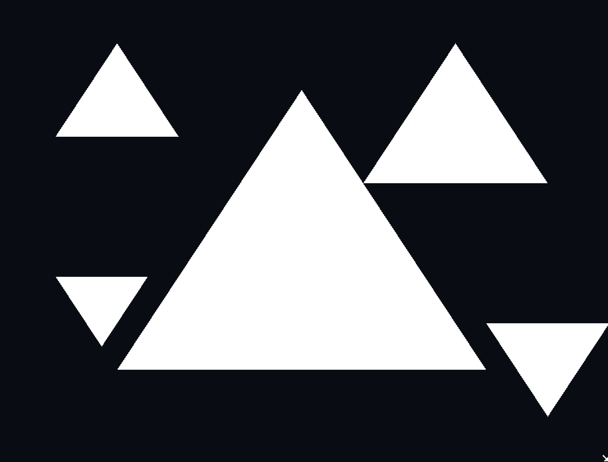
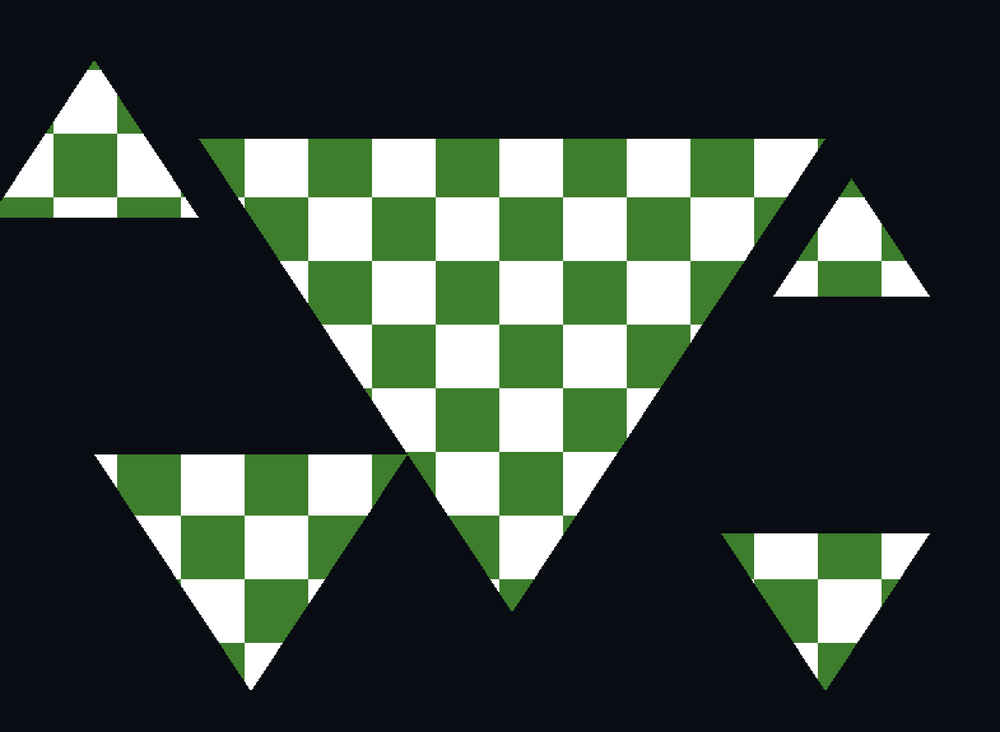

# Assignment 1
## 1 c)
five distinct triangles:

## 2 a)
Screenshot of the result:

### I)
The name of this phenomenon is clipping and happens whenever a portion of a model is outside of a specified region of space
### II)
This occurs whenever a portion of a model is outside of a specified area. In this case it seems the canvas only displays z,y and z values within range -1.0 to 1.0, this "canvas" is usually called a clipbox. This means that every point defined outside of this clipbox will be clipped.
### III)
Its purpose is to discard all geometry that is outside of the clipbox. Another purpose for clipping is to discard all objects behind the camera and those too close to it. 

## 2 b)

### I) 
Here i have defined two triangles, the one visible in the screenshot and another one not visible as it disappears.
### II)
This happens because OpenGL has backface culling is enabled.
### III)
The condition under which this effect occurs is that the vertices are clockwise. Vertices in OpenGl are rendered counterclockwise and when the vertices are rendered clockwise, OpenGL understands this as facing away from the camera. The triangle is therefore not rendered.

## 2 c)
### I)
 It is important to ensure that the depth information accurately represents the current state of the 3D scene. If the depth buffer is not reset each frame, it may lead to objects that are behind other objects to be rendered in front of them.

 ### II)
 A fragment shader can be executed multiple times for the same pixel whenever primitives are overlapping. 

 ### III)
 The two most common types of shader are fragment and vertex shaders.
 Vertex shaders are the first step of the graphics pipeline and it is responsible for processing each vertex by doing transformations like translations and rotations before sending the vertices to the fragment shader. 

 The fragment shader operates on each pixel and is responsible for determining the final color and appearance of each pixel in the scene. 

 ### IV)
 It is common to use and index buffer to specify which vertices should be connected into triangles, because we it allows us to reuse vertices between triangles. This can save memory usage if done well.

 ### V)
A situation where we would pass a non-zero value into this section is whenever we would like to pass in texture coordinates and not begin at index zero but rather the index where the texture coordinates begin.

## d)
image flipped both vertically and horizontally. I achieved this by multiplying a transformation matrix to the positional vector

To change the color of the image i modified the fragment shader, as the color was defined by rgba values ranging from 1.0-0.0 i changed green and blue values to zero leaving only the red color. 

## 3
I managed to create the checkered pattern
